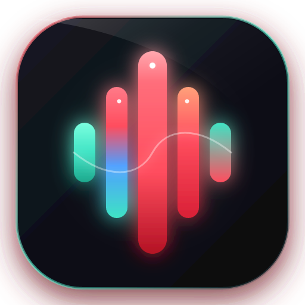

<div align="center">



# Forge Wisper

**Next-Generation Open-Source Voice-to-Structured-Text Desktop Application**

*Speak naturally. Release. Receive clean, formatted, verified text directly at your cursor.*

[](https://www.rust-lang.org/)
[](https://tauri.app/)
[](https://react.dev/)
[](https://www.typescriptlang.org/)
[](LICENSE)
[](#)

</div>

---

## ⚡ What is Forge Wisper?

**Forge Wisper** is a high-performance, privacy-first desktop application designed around a frictionless, instant dictation workflow. Whether you're drafting code documentation in VS Code, messaging on Slack/Discord, or writing emails, Forge Wisper captures your voice, removes spoken pauses, executes self-corrections, formats lists, and pastes clean text straight into your active application.

```text
[ Global Shortcut: Ctrl + Space ]
                ↓
    🎙️ Speak Naturally (with pauses, corrections, or list items)
                ↓
    ⚡ Speech Recognition (Groq LPUs / Offline Local Whisper)
                ↓
    🧠 Rule-Based Cleaner (Filler Removal + Intent Correction)
                ↓
    🛡️ Verification Engine (Preserves numbers, dates & technical terms)
                ↓
    📋 Safe Auto-Paste into Active Application (with Clipboard Fallback)
```

---

## ✨ Key Features

- **⚡ Blazing Fast Cloud Transcription (Groq Whisper)**: Sub-second audio processing with `whisper-large-v3-turbo` powered by Groq LPUs. API keys are safely stored in your native OS Keyring.
- **🔒 Private & Offline Local Whisper**: Run Whisper directly on your machine (whisper.cpp / GGUF models) without any audio or text ever leaving your device.
- **🧠 Intelligent Rule-Based Voice Cleaner**:
  - **Filler Removal**: Automatically purges verbal crutches like *"um"*, *"ah"*, *"like, you know"*.
  - **Real-Time Self-Correction**: Say *"meet at 5 PM, no actually 6 PM"* $\to$ outputs *"6 PM"*.
  - **Contextual Formatting**: Spoken commands (*"bullet point"*, *"new line"*, *"todo item"*) format directly into clean markdown structures.
- **📖 Personal Dictionary & Voice Macro Expansions**:
  - **Phonetic Word Mappings**: Corrects brand names and technical jargon (e.g. *"lang chain"* $\to$ `LangChain`, *"postgres"* $\to$ `PostgreSQL`).
  - **Voice Snippets & Prompt Shortcuts**: Speak triggers like *"my signature"* or *"meeting notes"* to expand full formatted templates.
  - **Live Testing Sandbox**: Built-in interactive sandbox to test expansions in real time.
- **🛡️ Verification & Safe Auto-Paste**:
  - Cross-verifies entity integrity (dates, currencies, numbers) between raw and cleaned text to prevent dropped details.
  - Simulates keyboard paste into whatever window currently has text focus, with automatic clipboard backup.
- **📚 Searchable SQLite History**:
  - Search past dictations, copy raw or cleaned transcripts, and configure automated data retention policies (7 days, 30 days, or indefinite).
- **🎨 Forge Modern Aesthetic**:
  - Dark, Light, and System themes crafted with sleek typography, custom scrollbars, and fully responsive layouts across all window sizes.

---

## 🚀 How Speech Processing Works in Practice

| Feature | Spoken Input | Formatted Output |
| :--- | :--- | :--- |
| **Filler Removal** | *"Um, we should, ah, deploy the new release."* | *"We should deploy the new release."* |
| **Self-Correction** | *"Let's ship on Tuesday, wait no Thursday morning."* | *"Let's ship on Thursday morning."* |
| **Spoken Lists** | *"todo item review pull request todo item run tests"* | `• [ ] review pull request`<br>`• [ ] run tests` |
| **Word Mappings** | *"check this in vs code with py torch and groq"* | *"check this in VS Code with PyTorch and Groq"* |
| **Spoken Emails** | *"email slide to ali dot khan at the rate gmail dot com"* | *"email slide to ali.khan@gmail.com"* |
| **Voice Macros** | *"please review this update my signature"* | *"please review this update<br><br>Best regards,<br>Zazan Ali<br>Lead Developer"* |

---

## 🗣️ Spoken Voice Commands

Forge Wisper recognizes natural speech cues, spoken emails, and punctuation out of the box:

| Category | Spoken Phrase | Output |
| :--- | :--- | :--- |
| **Emails** | `"ali dot khan at gmail dot com"`, `"ali. Khan at the gmail. Com"` | `ali.khan@gmail.com` |
| **Websites** | `"visit www dot google dot com for search"` | `visit www.google.com for search` |
| **Structure** | `"new paragraph"` / `"next paragraph"` | `\n\n` (Double Line Break) |
| **Structure** | `"new line"` / `"next line"` | `\n` (Single Line Break) |
| **Lists** | `"bullet point"` / `"bullet"` | `\n- ` (Bullet Item) |
| **Checklists** | `"checkbox"` / `"todo item"` | `\n- [ ] ` (Task Item) |
| **Punctuation** | `"comma"`, `"period"`, `"question mark"`, `"exclamation mark"` | `,` `.` `?` `!` |
| **Symbols** | `"open parenthesis"`, `"close parenthesis"`, `"quote"` | `(` `)` `"` |
| **Symbols** | `"at sign"`, `"hashtag"`, `"colon"`, `"semicolon"` | `@` `#` `:` `;` |

---

## 🏗️ Architecture & Monorepo Structure

```text
forge-wisper/
├── apps/
│   └── desktop/                 # Tauri v2 + React 19 + TypeScript + Tailwind Frontend
│       ├── src/                 # Application UI views & components
│       │   ├── views/           # Dashboard, History, Models, Dictionary, Settings
│       │   └── components/      # ForgeLogo, FloatingRecorder, Navigation
│       └── src-tauri/           # Tauri Rust Application Entry & Global Shortcut Handler
├── crates/                      # Modular, Testable Rust Backend Micro-Crates
│   ├── audio/                   # Low-latency microphone recording (cpal + hound)
│   ├── cleanup/                 # Rule-based cleanup, email normalization & word dictionary
│   ├── output/                  # Native OS input injection & keyboard paste simulator
│   ├── security/                # OS Keyring credential storage (Groq API keys)
│   ├── storage/                 # SQLite database engine & transcript retention
│   ├── transcription/           # Provider abstraction traits for speech engines
│   └── verification/            # Entity preservation & safety verification layer
└── providers/                   # Speech Recognition Providers
    ├── groq/                    # Cloud Whisper via Groq LPU API
    └── local-whisper/           # Offline on-device Whisper (whisper.cpp) with auto-discovery
```

---

## 🛠️ Getting Started

### Prerequisites

- **[Node.js 18+](https://nodejs.org/)** and **[pnpm](https://pnpm.io/)** (`npm install -g pnpm`)
- **[Rust](https://rustup.rs/) (1.78+)** with MSVC Build Tools on Windows
- **[Tauri v2 CLI](https://tauri.app/)** (`cargo install tauri-cli --version "^2.0.0"`)

### Installation & Development

1. **Clone the repository**:
   ```bash
   git clone https://github.com/zazanali/forge-wisper.git
   cd forge-wisper
   ```

2. **Install frontend dependencies**:
   ```bash
   pnpm install
   ```

3. **Run in Desktop Development Mode**:
   ```bash
   pnpm tauri:dev
   ```

4. **Build Production Installer / Executable**:
   ```bash
   pnpm tauri:build
   ```

### Running Test Suite

```bash
# Run all unit and integration tests across all Rust crates
cargo test --workspace

# Run speech cleanup and email normalization test suite
cargo test --package forge-cleanup
```

---

## 🔒 Security & Privacy

- **No Cloud Audio Storage**: Audio recordings are processed in memory and discarded immediately after transcription.
- **Secure Key Storage**: API credentials (such as Groq keys) are stored using native OS secret vaults (Windows Credential Manager, macOS Keychain, Linux Secret Service) via the `keyring` crate.
- **Local-First Processing**: When using **Local Whisper**, 100% of speech recognition and text cleaning happens entirely on your local CPU/GPU with no internet access required.

---

## 🤝 Contributing

Contributions are welcome! If you'd like to help improve Forge Wisper:

1. Fork the repository.
2. Create your feature branch (`git checkout -b feature/amazing-feature`).
3. Commit your changes (`git commit -m 'Add some amazing feature'`).
4. Push to the branch (`git push origin feature/amazing-feature`).
5. Open a Pull Request.

---

## 👤 Author & Creator

**Ali Zazan**
- GitHub: [@zazanali](https://github.com/zazanali)
- Repository: [Forge Wisper](https://github.com/zazanali/forge-wisper)

*Crafted with ❤️ by Ali Zazan • Built for developers and creators worldwide.*

---

## 📄 License

Distributed under the **MIT License**. See [LICENSE](LICENSE) for more information.

Third-party models (such as OpenAI Whisper models) remain subject to their respective original licenses.
